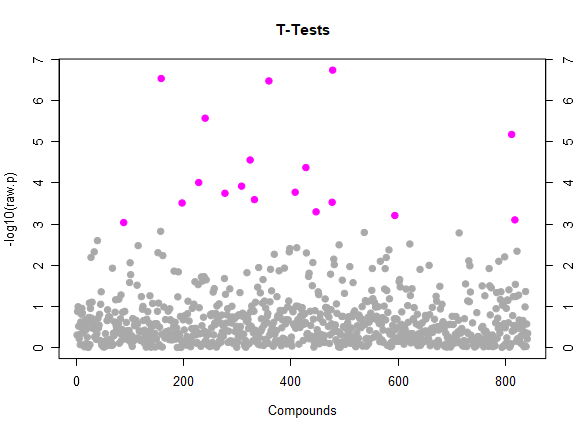
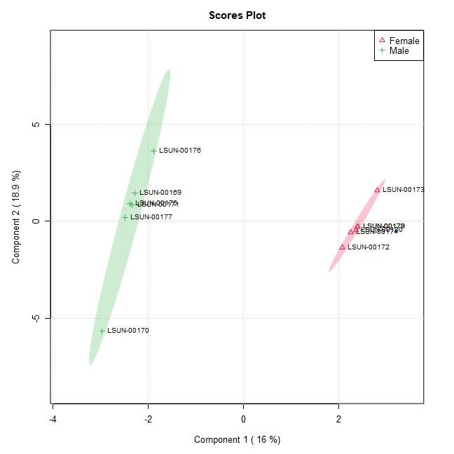

```{r setup, include=FALSE}
knitr::opts_chunk$set(echo = FALSE,warning = FALSE, message = FALSE)
```


\newpage

# Key points to remember for metabolomics data analysis:

##  Raw data processing: 

 * The MS data converted and centroied by using MSconvert (https://proteowizard.sourceforge.io/) in mzML format.
 * The mzML file then converted to feature matrix using Nextflow (metaboIGNITER). But metaboIGNITER cannot provide metabolites name for MS1 data, instead it gives ids only. Which is a major drawback of using metaboIGNITER. 
 * The alternative to metaboIGNITER is using MetaboanalystR for mzML to feateature matrix but that process also stacked at certain points ( this function not executing when following their tutorial :PerformDBSearchingBatch).
 * At this a result we could not find a smooth analysis pipeline to convert the raw mzML to a feature matrix to start the statistical analysis section. 
 
## Statistical Analysis:

 * Using MetaboAnalystR we can run all the required statistical analysis in our local environment if someone provide us the feature matrix with the peaks read. 
 * For the pathway analysis, MetaboAnalystR webpage is very powerful and easy to use. Because it save time and give us a very well written repot of the analysis automatically. As a result for pathway analysis using webpage is more logical. 
 
## Future Direction

 * We need to find alternative way to process the raw data which can give us metabolites name instead the ids. 
 * We can keep an eye on metaboIGNITER and also see some alternative solution in Python.
 


# Loading the data and prepare for further steps:

We used a very specific data format to start the analysis procedure. 

```{r}

# Clean global environment
rm(list = ls())
setwd("C:/Users/mho004/OneDrive - LSU Health Shreveport/Bioinformatics/Metabolomics/Projects (Real data)/Heart Mass Spectrsocopy Gender impact Dec 23/HFD")
# 1. Loading data

library(MetaboAnalystR, lib.loc = "C:/R/R-4.3.2/library")
library(data.table)
library(pls)
library(spls)

mSet<-InitDataObjects(data.type = "conc", anal.type = "stat", paired= FALSE)
mSet<-Read.TextData(mSetObj =  mSet,filePath =  "C:/Users/mho004/OneDrive - LSU Health Shreveport/Bioinformatics/Metabolomics/Projects (Real data)/Heart Mass Spectrsocopy Gender impact Dec 23/Data/HFD.csv",
                    format =  "rowu", lbl.type = "disc");

mSet<-SanityCheckData(mSetObj = mSet)

```


```{r}
#mSet<-ReplaceMin(mSet); # Replace zero/missing values by half of the smallest positive value in the original dataset.
mSet<-PreparePrenormData(mSet);
mSet<-Normalization(mSet, "NULL", "NULL", "NULL", "NULL", ratio=FALSE, ratioNum=20) # Normalization 

mSet<-PlotNormSummary(mSet, "norm_0_", format ="png", dpi=72, width=NA) # Feature view or by metabolites
#mSet<-PlotSampleNormSummary(mSet, "Plots/snorm_0_", format = "png", dpi=72, width=NA); # Sample view (subject view)


```

```{r echo=FALSE, out.width = "100%", fig.align = "center"}

```


# Fold-change analysis

```{r}
# Perform fold-change analysis on uploaded data, unpaired
mSet<-FC.Anal(mSet, 2.0, 0, FALSE)

# Plot fold-change analysis
mSet<-PlotFC(mSet, "fc_0_", "png", 72, width=NA)


# To view fold-change 
#mSet$analSet$fc$fc.log
```


```{r echo=FALSE, out.width = "100%", fig.align = "center"}

```


# T-test (FDR-adjusted p-values)

```{r}
# Perform T-test (parametric)
mSet<-Ttests.Anal(mSet, nonpar=F, threshp=0.05, paired=FALSE, equal.var=TRUE, "fdr", FALSE)
# Plot of the T-test results
mSet<-PlotTT(mSet, imgName = "tt_0_", format = "png", dpi = 72, width=NA)

```

```{r echo=FALSE, out.width = "100%", fig.align = "center"}

```


#  Volcano Plot (FDR-adjusted p-values)


```{r}

# Perform the volcano analysis
mSet<-Volcano.Anal(mSet, FALSE, 2.0, 0, F, 0.05, TRUE, "raw")
mSet<-PlotVolcano(mSet, "volcano_0_", 1, 0, format ="png", dpi=72, width=NA)


significant_metabolits <- rownames(mSet$analSet$volcano$sig.mat)

# Create the volcano plot
#mSet <- my.plot.volcano(mSet, "volcano_0_", 1, 0, format ="png", dpi=72, width=NA)

```


```{r echo=FALSE, out.width = "100%", fig.align = "center"}

```


# Correlation Analysis 

A small subset of metabolites is ideal to do correlation analysis otherwise it's hard to interpret the results.

```{r}

sig_metabolites <- rownames(mSet$analSet$tt$sig.mat)
library(readr)
dat <- read_csv("C:/Users/mho004/OneDrive - LSU Health Shreveport/Bioinformatics/Metabolomics/Projects (Real data)/Heart Mass Spectrsocopy Gender impact Dec 23/Data/HFD.csv")

library(dplyr)
sub_dat <- dat %>%
  select(all_of(sig_metabolites))
 
# Calculate correlation matrix
correlation_matrix <- cor(sub_dat)
library("pheatmap")
pheatmap(correlation_matrix,fontsize = 6)

```

# Pattern Searching for 2,4-dihydroxybutyrate

```{r}
# Perform correlation analysis on a pattern (a feature of interest in this case)
mSet<-FeatureCorrelation(mSet, "pearson", "2,4-dihydroxybutyrate")

# Plot the correlation analysis on a pattern
mSet<-PlotCorr(mSet, "ptn_3_", format="png", dpi=72, width=NA)
```


```{r echo=FALSE, out.width = "100%", fig.align = "center"}

```


# Principal component analysis

```{r}
# Perform PCA analysis
mSet<-PCA.Anal(mSet)

# Create PCA overview
mSet<-PlotPCAPairSummary(mSet, "pca_pair_0_", format = "png", dpi = 72, width=NA, 5)

# Create PCA scree plot
mSet<-PlotPCAScree(mSet, "pca_scree_0_", "png", dpi = 72, width=NA, 5)

# Create a 2D PCA score plot
mSet<-PlotPCA2DScore(mSet, "pca_score2d_0_", format = "png", dpi=72, width=NA, 1, 2, 0.95, 1, 0)

# Create a 3D PCA score plot
mSet<-PlotPCA3DScoreImg(mSet, "pca_score3d_0_", "png", 72, width=NA, 1,2,3, 40)

# Create a PCA loadings Plots
mSet<-PlotPCALoading(mSet, "pca_loading_0_", "png", 72, width=NA, 1,2);

# Create a PCA Biplot
#mSet<-PlotPCABiplot(mSet, "pca_biplot_0_", format = "png", dpi = 72, width=NA, 1);
```


```{r echo=FALSE, out.width = "100%", fig.align = "center"}

```

# Partial Least Squares - Discriminant Analysis (PLS-DA)

```{r}
mSet<-PLSR.Anal(mSet, reg=TRUE);

mSet<-PlotPLSPairSummary(mSet, "pls_pair_0_", "png", 72, width=NA, 5);

mSet<-PlotPLS2DScore(mSet, "pls_score2d_0_", "png", 72, width=NA, 1,2,0.95,1,0);

mSet<-PlotPLS3DScoreImg(mSet, "pls_score3d_0_", "png", 72, width=NA, 1,2,3, 40);

mSet<-PlotPLSLoading(mSet, "pls_loading_0_", "png", 72, width=NA, 1, 2);

mSet<-PLSDA.CV(mSet, "T",5, "Q2");


mSet<-PlotPLS.Classification(mSet, "pls_cv_0_", "png", 72, width=NA);

mSet<-PlotPLS.Imp(mSet, "pls_imp_0_", "png", 72, width=NA, "vip", "Comp. 1", 15, FALSE);

mSet<-PLSDA.Permut(mSet, 100, "accu");

mSet<-PlotPLS.Permutation(mSet, "pls_perm_1_", "png", 72, width=NA);
```


```{r echo=FALSE, out.width = "100%", fig.align = "center"}

```


```{r echo=FALSE, out.width = "100%", fig.align = "center"}

```


# Sparse Partial Least Squares - Discriminant Analysis (sPLS-DA)

```{r}
# Perform sPLS-DA analysis
mSet<-SPLSR.Anal(mSet, 5, 10, "same", "Mfold")

# Plot sPLS-DA overview
mSet<-PlotSPLSPairSummary(mSet, "spls_pair_0_", format = "png", dpi=72, width=NA, 5)

# Create 2D sPLS-DA Score Plot
mSet<-PlotSPLS2DScore(mSet, "spls_score2d_0_", format = "png", dpi=72, width=NA, 1, 2, 0.95, 1, 0)

# Create 3D sPLS-DA Score Plot
mSet<-PlotSPLS3DScoreImg(mSet, "spls_score3d_0_", format = "png", 72, width=NA, 1, 2, 3, 40)

# Create sPLS-DA loadings plot
mSet<-PlotSPLSLoading(mSet, "spls_loading_0_", format = "png", dpi=72, width=NA, 1,"overview")

# Perform cross-validation and plot sPLS-DA classification
mSet<-PlotSPLSDA.Classification(mSet, "spls_cv_0_", format = "png", dpi=72, width=NA)


mSet<-PlotPLS.Imp(mSet, "spls_imp_0_", "png", 72, width=NA, "vip", "Comp. 1", 15, FALSE);
```


```{r echo=FALSE, out.width = "100%", fig.align = "center"}

```


```{r echo=FALSE, out.width = "100%", fig.align = "center"}
knitr::include_graphics("spls_imp_0_dpi72.png")
```


# Hierarchical Clustering: Dendogram

```{r}
# Perform hierarchical clustering and plot dendogram
mSet<-PlotHCTree(mSet, "tree_0_", format = "png", dpi=72, width=NA, "euclidean", "ward.D")

```


```{r echo=FALSE, out.width = "100%", fig.align = "center"}

```
# Hierarchical Clustering: Heatmaps

```{r}
mSet<-PlotHeatMap(mSet, "heatmap_0_", "png", 72, width=NA, "norm", "row", "euclidean", "ward.D","bwm", 8, "overview", T, T, NULL, T, F, T, T, T)
```

```{r echo=FALSE, out.width = "100%", fig.align = "center"}


```


# Partitional Clustering: K-Means

```{r}
# Perform K-means analysis
mSet<-Kmeans.Anal(mSet, 3)

# Plot K-means analysis 
mSet<-PlotKmeans(mSet, "km_0_", format = "png", dpi=72, width=NA)
```


```{r echo=FALSE, out.width = "100%", fig.align = "center"}


```


# Partitional Clustering: Self Organizing Maps (SOM)


```{r}
# Perform SOM analysis
mSet<-SOM.Anal(mSet, 1, 3,"linear","gaussian")

# Plot SOM analysis
mSet<-PlotSOM(mSet, "som_0_", format = "png", dpi=72, width=NA)
```


```{r echo=FALSE, out.width = "100%", fig.align = "center"}


```

# Random Forest

```{r}
# Perform random forest analysis
mSet<-RF.Anal(mSet, 500, 7, 1)

# Plot random forest classification
mSet<-PlotRF.Classify(mSet, "rf_cls_0_", format = "png", dpi=72, width=NA)

# Plot random forest variables of importance
mSet<-PlotRF.VIP(mSet, "rf_imp_0_", format = "png", dpi=72, width=NA)

# Plot random forest outliers 
mSet<-PlotRF.Outlier(mSet, "rf_outlier_0_", format = "png", dpi=72, width=NA)


```


```{r echo=FALSE, out.width = "100%", fig.align = "center"}


```


```{r echo=FALSE, out.width = "100%", fig.align = "center"}


```
```{r echo=FALSE, out.width = "100%", fig.align = "center"}

```


# Support Vector Machine (SVM)

```{r}
# Perform SVM 
mSet<-RSVM.Anal(mSet, 10)

mSet<-PlotRSVM.Classification(mSet, "svm_cls_0_", format = "png", dpi=72, width=NA)

mSet<-PlotRSVM.Cmpd(mSet, "svm_imp_0_", format = "png", dpi=72, width=NA)
```


```{r echo=FALSE, out.width = "100%", fig.align = "center"}

```


```{r echo=FALSE, out.width = "100%", fig.align = "center"}

```


